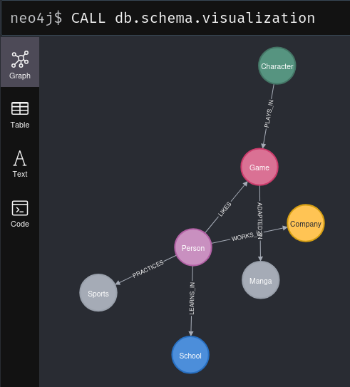

# Run these queries of your graph model in Neo4j

This activity is about running my first queries in Neo4j. I will use the graph data model created in the previous activity to run the queries.

Here is the graph data model in neo4j:

