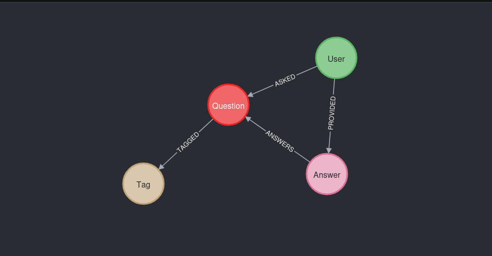

# Create a graph model from a stackoverflow dataset

The goal of this activity is to create a graph data model from a stackoverflow dataset and generate the Cypher to create the graph.
You can find the Cypher code in the file `load_json.cypher` and the image of the data model in the file `data_model.png`.

Here is the data_model:

