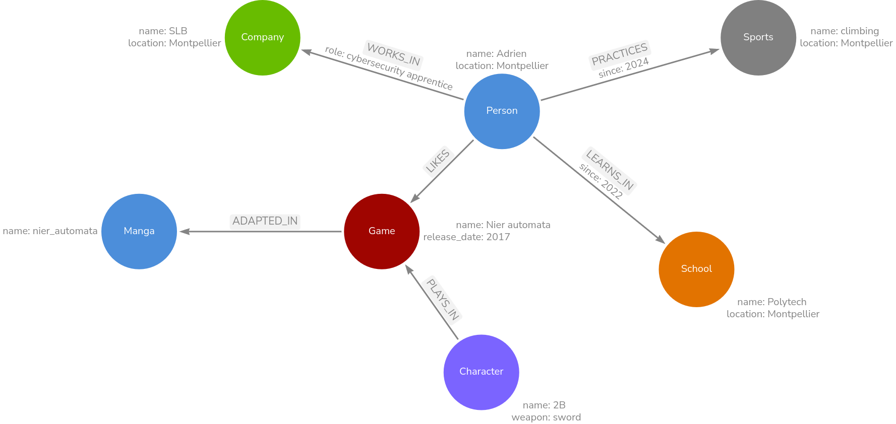

# Create your graph data model and generate the Cypher and image of your model

The goal of this activity is to create a **graph data model** for a random scenario related to me and generate the Cypher to create the graph.
You can find the Cypher code in the file `init_data_model.cypher` and the image of the data model in the file `init_data_model.png`.

Here is the data_model:

