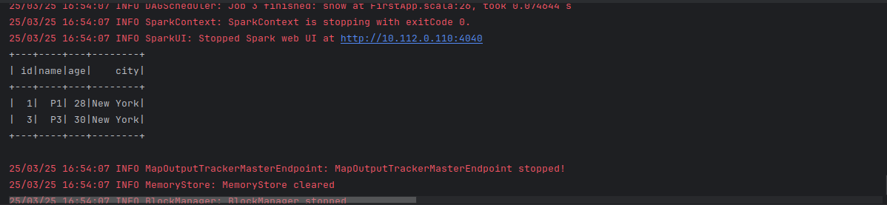

# Run the spark quick start program on Kubernetes using Spark operator

Create the spark operator and MinIO database:

```bash
helmfile apply
```

Create the SparkApplication & serviceAccount:

```bash
k apply -f SparkApplication.yaml
```

Here is the result:

