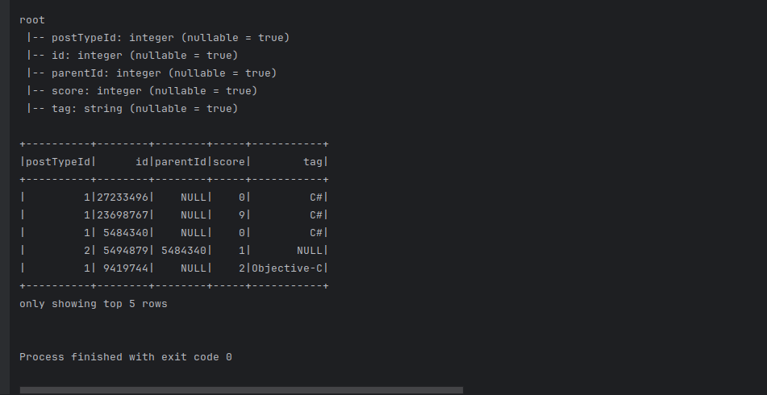
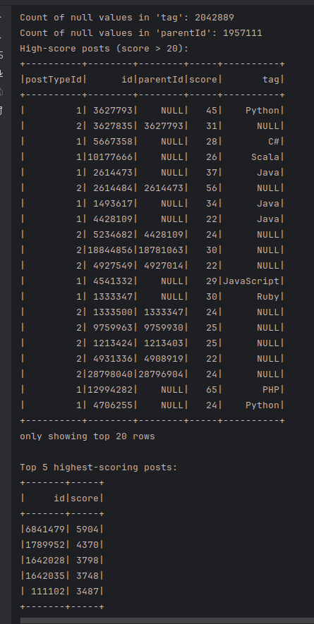
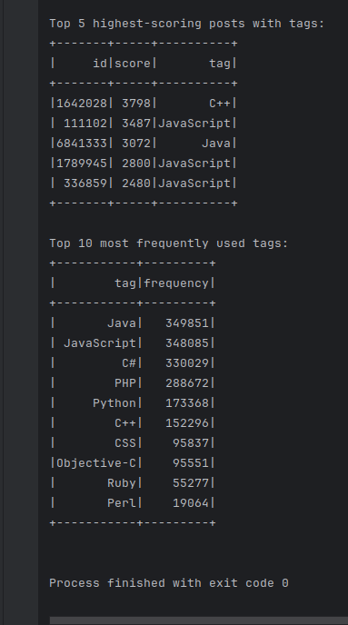

# Stack overflow data analysis

The goal of this activity is to analyze Stack Overflow data using Spark. As an input, we have a stack overflow dump file in csv format.

Here is the code:

```scala
import org.apache.spark.sql.SparkSession
import org.apache.spark.sql.functions._
import org.apache.spark.sql.types.{IntegerType, StringType, StructType}

object ReadCSV {
  def main(args: Array[String]): Unit = {
    // Path to the CSV data file
    val csvDataFile = "/home/linux_friendly/Documents/Others/Databases/neo4j_intro/activity_7/stackoverflow.csv"

    // Create a Spark session with custom configurations
    val spark = SparkSession.builder
      .appName("Stackoverflow Application")
      .config("spark.driver.memory", "8G") // Allocate 8GB of memory to the driver
      .master("local[*]") // Run locally using all available CPU cores
      .getOrCreate()

    spark.sparkContext.setLogLevel("ERROR")

    // Define schema for reading the CSV file
    val schema = new StructType()
      .add("postTypeId", IntegerType, nullable = true)
      .add("id", IntegerType, nullable = true)
      .add("acceptedAnswer", StringType, nullable = true)
      .add("parentId", IntegerType, nullable = true)
      .add("score", IntegerType, nullable = true)
      .add("tag", StringType, nullable = true)

    // Read the CSV file into a DataFrame with the specified schema
    val df = spark.read
      .option("header", "false") // No header row
      .schema(schema) // Apply schema
      .csv(csvDataFile)
      .drop("acceptedAnswer")

    // Print total number of records in the dataset
    println(s"\nCount of records in CSV file: ${df.count()}")
    // Print schema and show a sample of 5 rows
    df.printSchema()
    df.show(5)

    // Count null values for specific columns
    println(
      "\nCount of null values in 'tag': " + df.filter(col("tag").isNull).count() +
        "\nCount of null values in 'parentId': " + df.filter(col("parentId").isNull).count()
    )

    // Filter posts with a score greater than 20
    val highScorePosts = df.filter(col("score") > lit(20)) // Ensure correct type comparison

    // Show high-score posts
    println("High-score posts (score > 20):")
    highScorePosts.show()

    // Register the DataFrame as a SQL temporary view for querying
    df.createOrReplaceTempView("stackoverflow")

    // Query 1: Retrieve top 5 posts with the highest scores
    val top5Scores = spark.sql("SELECT id, score FROM stackoverflow ORDER BY score DESC LIMIT 5")
    println("Top 5 highest-scoring posts:")
    top5Scores.show()

    // Query 2: Retrieve top 5 highest-scoring posts that have a tag
    val top5ScoresWithTag = spark.sql("""
        SELECT id, score, tag
        FROM stackoverflow
        WHERE tag IS NOT NULL
        ORDER BY score DESC
        LIMIT 5
      """)
    println("Top 5 highest-scoring posts with tags:")
    top5ScoresWithTag.show()

    // Query 3: Find the 10 most frequently used tags in the dataset
    val popularTags = spark.sql("""
      SELECT tag, COUNT(*) as frequency
      FROM stackoverflow
      WHERE tag IS NOT NULL
      GROUP BY tag
      ORDER BY frequency DESC
      LIMIT 10
    """)
    println("Top 10 most frequently used tags:")
    popularTags.show()

    // Stop the Spark session
    spark.stop()
  }
}
```

Here are the results:


Query 1: Retrieve schema of the dataset:



Query 2: Retrieve top 5 highest-scoring posts that have a tag:



Query 3: Find the 10 most frequently used tags in the dataset:

