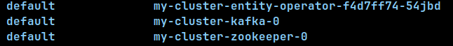
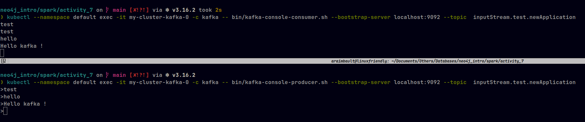

# Install kafka and send your first message

## Install Kafka

To manage our kafka in the cluster, we will use strimzi operator. Strimzi is a CNCF project that provides a way to run an Apache Kafka cluster on Kubernetes or OpenShift in various deployment configurations.

```bash
helmfile apply
```

Will install the strimzi operator in the cluster.

## Declare a custom resource 'Kafka'

```bash
kubectl apply -f kafka-zookeeper.yaml
```

Will create a ressource of type 'Kafka' in the cluster. This ressource should provide 1 kafka broker and 1 zookeeper. See screenshot below:



## Send your first message

Create a consomumer to listen to the new topic 'inputStream.test.newApplication'

```bash
kubectl --namespace default exec -it my-cluster-kafka-0 -c kafka -- bin/kafka-console-consumer.sh --bootstrap-server localhost:9092 --topic  inputStream.test.newApplication
```

Create a producer to send a message to the topic 'inputStream.test.newApplication'

```bash
kubectl --namespace default exec -it my-cluster-kafka-0 -c kafka -- bin/kafka-console-producer.sh --bootstrap-server localhost:9092 --topic  inputStream.test.newApplication
```

You should see something like this:


