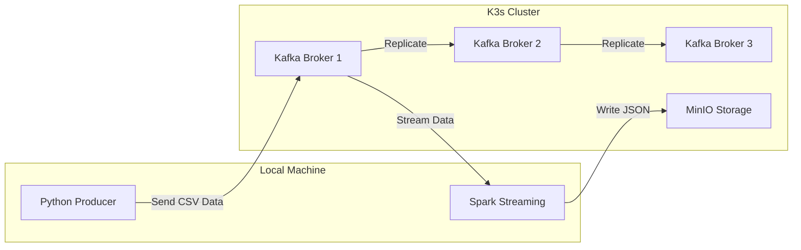
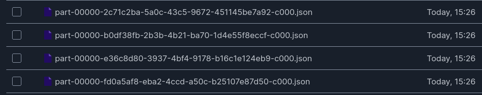
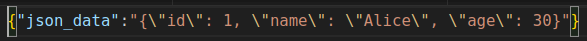

# Connecting Kafka -> Spark -> MinIO

## Architecture



---

## Deploying Kafka on K3s

### Prerequisites

- [K3s](https://k3s.io/)
- MinIO (See Activity 1)
- Strimzi Operator
- Kafka Custom Resource (See Activity 7.1)

---

## Writing a Kafka Producer in Python

Create a script `producer.py` to send CSV data to Kafka:

```python
import csv
import time
import json
from kafka import KafkaProducer

# Define the Kafka producer
producer = KafkaProducer(
    bootstrap_servers='localhost:9092',  # Replace with your Kafka broker
    value_serializer=lambda v: json.dumps(v).encode('utf-8')  # Serialize data to JSON
)

# Define the Kafka topic
topic = '<topic_name>'

# Function to generate CSV data and send it to Kafka
def generate_csv_data():
    # Simulate generating CSV data
    fieldnames = ['id', 'name', 'age']
    rows = [
        {'id': 1, 'name': 'Alice', 'age': 30},
        {'id': 2, 'name': 'Bob', 'age': 25},
        {'id': 3, 'name': 'Charlie', 'age': 35},
        {'id': 4, 'name': 'Diana', 'age': 28}
    ]
    
    # Convert to CSV format and send each row to Kafka
    for row in rows:
        producer.send(topic, value=row)
        print(f"Sent: {row}")
        time.sleep(1)  # Wait for 1 second before sending the next row

# Main execution loop
if __name__ == '__main__':
    try:
        generate_csv_data()
    except KeyboardInterrupt:
        print("Producer stopped.")
    finally:
        producer.flush()
        producer.close()
```

Run the producer:

```bash
python3 producer.py
```

---

## Consuming Data with Spark and Storing it in MinIO

Create a file `SparkStreamingKafka.scala`:

```scala
import org.apache.spark.sql.SparkSession
import org.apache.spark.sql.types.{IntegerType, StringType, StructField, StructType}

object SparkStreamingKafka {

  def main(args: Array[String]): Unit = {
    val spark = SparkSession.builder
      .appName("SparkStreamingKafka")
      .master("local[*]") // Adjust for your cluster setup
      .config("spark.hadoop.fs.s3a.endpoint", "http://localhost:9000") // MinIO URL
      .config("spark.hadoop.fs.s3a.access.key", "rootuser") // MinIO Access Key
      .config("spark.hadoop.fs.s3a.secret.key", "rootpass123") // MinIO Secret Key
      .config("spark.hadoop.fs.s3a.path.style.access", "true") // Required for MinIO
      .config("spark.hadoop.fs.s3a.impl", "org.apache.hadoop.fs.s3a.S3AFileSystem") // Ensure S3A is used
      .getOrCreate()

    import spark.implicits._

    val kafkaDF = spark.readStream
      .format("kafka")
      .option("kafka.bootstrap.servers", "localhost:9092")  // Kafka broker address
      .option("subscribe", "inputStream.test.newApplication") // Kafka topic
      .option("startingOffsets", "latest") // Read from latest messages
      .load()

    // Convert Kafka message from binary to string
    val messagesDF = kafkaDF
      .selectExpr("CAST(value AS STRING)")
      .toDF("json_data")

    val query = messagesDF.writeStream
      .format("json")
      .option("path", "s3a://data/kafka/json/") // Output path in MinIO
      .option("checkpointLocation", "s3a://data/kafka/checkpoints/") // Checkpoint directory
      .outputMode("append")
      .start()

    query.awaitTermination()
  }
}
```

## Result

Input :

```json
{'id': 1, 'name': 'Alice', 'age': 30},
{'id': 2, 'name': 'Bob', 'age': 25},
{'id': 3, 'name': 'Charlie', 'age': 35},
{'id': 4, 'name': 'Diana', 'age': 28}
```

Output :



That contains :



This pipeline ensures that:

- **Python produces CSV data**, sending it to a **Kafka topic**.
- **Kafka distributes the messages** among brokers.
- **Spark Streaming consumes Kafka messages**, processes them, and writes them as **JSON to MinIO**.
